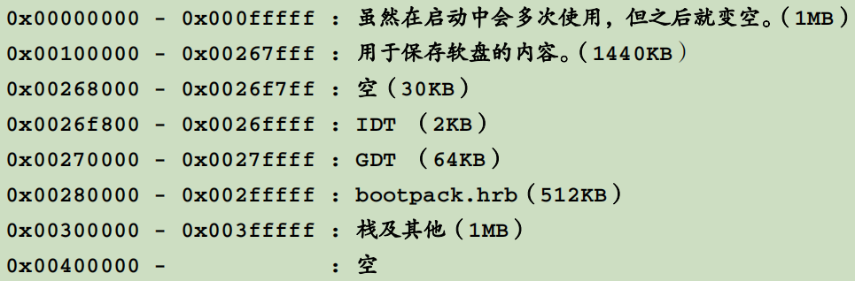
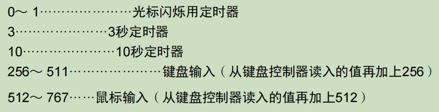

# HariOS

​	进入32位保护模式，进入内核后，初始化GDT、IDT、PIC，打开中断。

## 功能

### 0、字符打印

​	通过一个txt文件保存256个字符的编码，16行 * 8列。通过特定编译后，每个字符占位16个字节，每个字节当中的位，是1代表要打印，是0则不打印。

### 1、中断

​	以_asm_handler21为例，将函数注册到IDT中，当遇到中断时，PIC向CPU发送2个字节的数据0xcd,0xxx，0xcd就是INT，以此让CPU把数据当作命令来执行来产生中断，调用这个汇编函数。该汇编函数保存好寄存器并设置好DS、ES段寄存器后，调用\_handler21（C程序）来处理程序。

#### 键盘中断

​	向0x64读数据，看位1是否为0，为0代表键盘控制电路准备完毕，然后进行模式设定。向0x60端口写入0x47，代表利用鼠标模式。

##### 键盘信息的解码

#### 鼠标中断

​	向键盘控制电路发送指令0xd4，下一个数据会发送给鼠标，发送激活指令后，正确的话会返回0xfa。

##### 鼠标信息的解码

​	每次移动鼠标，数据包含3个字节。第0个字节与移动、点击还是滑轮有关，第1个字节与左右移动有关，第2个字节与上下移动有关。

### 2、分段内存管理

​	首先做了内存容量检查。从start到end这块内存，以4KB为单位检查，向内存末尾中写入1个4字节数，翻转1次，然后再翻转1次，与相应的数比较是否相等来判断内存是否可用。

​	通过memman_alloc_4k和memman_free_4k来分配和释放内存。内存信息保存到MEMMAN结构体中，

### 3、窗口

背景size：1024 * 768

#### 图层

​	图层sheet用来表示窗口。用shtctl结构体管理所有的图层。初始化256个图层。支持分配图层、释放图层、滑动图层、**更新图层的高度**、**图层刷新**。优化：把图层的高度排序，将指针存放到另一个数组中。

#### 窗口切换

​	按tab依次切换窗口。同时每个task对应一个缓冲区，由key_win这个变量指向task对应的图层，key_win指向最顶层的图层。所有的task共用同一个fifo，由key_win来确定fifo中的信息到底是给哪个task。

### 4、定时器

​	置IRQ0为1。执行3次out操作设定每10ms发生一次中断。发生中断后，最终调用inthandler20来处理中断。支持设定多个计时器。**优化：**在定时器中断中，把所有的定时器排序放到链表中，表头存放第1个即将超时的定时器。用链表的原因：防止因为一次超时多个定时器以及插入新的定时器导致移位多而处理变慢。

### 5、多进程

​	**怎么创建一个进程？**

​	设定TSS

​	**多进程是怎么实现的？**

​	对任务分层，分了3个level，分别是0~2，如果第0个level有任务，则不会执行下面level的任务，同一个level中，设置不同的优先级，对应着不同的执行时间，通过时间片完成任务切换或者通过向顶层窗口输入来强制任务切换。

### 6、命令

mem

cls

dir

type xxx

##### 用户程序

walk

lines

stars

### 7、api


## 目录结构

### hankaku.txt

保存字体 // TODO

### bootpack.h

头文件

### asmhead.nas

启动内核的汇编程序，0x7c00，

##### 开启32位保护模式

1、通过将端口0x92的位1置为1，打开A20地址线。2、设定GDT。3、将CR0寄存器的位0置为1，切换到保护模式，更新段寄存器。4、将程序读取到指定位置，设置好栈段，通过GDT，jmp到bootpack（0x0028001b）。

### naskfunc.nas

实现无法用C语言直接编写的函数。

### graphic.c

用来显示、打印的文件

```c
void init_palette(void);
void set_palette(int start, int end, unsigned char *rgb);
void boxfill8(unsigned char *vram, int xsize, unsigned char c, int x0, int y0, int x1, int y1);
void init_screen8(char *vram, int x, int y);
void putfont8(char *vram, int xsize, int x, int y, char c, char *font);
/* print a string */
void putfonts8_asc(char *vram, int xsize, int x, int y, char c, unsigned char *s);
/* print the mouse */
void init_mouse_cursor8(char *mouse, char bc);
void putblock8_8(char *vram, int vxsize, int pxsize,int pysize, int px0, int py0, char *buf, int bxsize);	
#define COL8_000000		0
#define COL8_FF0000		1
#define COL8_00FF00		2
#define COL8_FFFF00		3
#define COL8_0000FF		4
#define COL8_FF00FF		5
#define COL8_00FFFF		6
#define COL8_FFFFFF		7
#define COL8_C6C6C6		8
#define COL8_840000		9
#define COL8_008400		10
#define COL8_848400		11
#define COL8_000084		12
#define COL8_840084		13
#define COL8_008484		14
#define COL8_848484		15
```

### dsctbl.c

与GDT、IDT有关

```c
/* GDT structure */
struct SEGMENT_DESCRIPTOR {
	short limit_low, base_low;
	char base_mid, access_right;
	char limit_high, base_high;
};
/* IDT structure */
struct GATE_DESCRIPTOR {
	short offset_low, selector;
	char dw_count, access_right;
	short offset_high;
};
/* init gdt and idt */
void init_gdtidt(void);
void set_segmdesc(struct SEGMENT_DESCRIPTOR *sd, unsigned int limit, int base, int ar);
void set_gatedesc(struct GATE_DESCRIPTOR *gd, int offset, int selector, int ar);
#define ADR_IDT			0x0026f800 /* address of IDT */
#define LIMIT_IDT		0x000007ff
#define ADR_GDT			0x00270000 /* address of GDT */
#define LIMIT_GDT		0x0000ffff
#define ADR_BOTPAK		0x00280000 /* address of bootpack.h */
#define LIMIT_BOTPAK	0x0007ffff
#define AR_DATA32_RW	0x4092
#define AR_CODE32_ER	0x409a
#define	AR_TSS32		0x0089
#define AR_INTGATE32	0x008e
```

### keyboard.c

```c
void inthandler21(int *esp);
void wait_KBC_sendready(void);
void init_keyboard(struct FIFO32 *fifo, int data0);
#define PORT_KEYDAT		0x0060
#define PORT_KEYCMD		0x0064
```

### mouse.c

```c
struct MOUSE_DEC {
	unsigned char buf[3], phase;
	int x, y, btn;
};
void inthandler2c(int *esp);
void enable_mouse(struct FIFO32 *fifo, int data0, struct MOUSE_DEC *mdec);
int mouse_decode(struct MOUSE_DEC *mdec, unsigned char dat);
```

### fifo.c

缓冲区，用来存储中断产生的信息等等。

```c
struct FIFO32 {
	int *buf;
	int p, q, size, free, flags;
	struct TASK *task;
};
void fifo32_init(struct FIFO32 *fifo, int size, int *buf, struct TASK *task);
int fifo32_put(struct FIFO32 *fifo, int data);
int fifo32_get(struct FIFO32 *fifo);
int fifo32_status(struct FIFO32 *fifo);
```

### memory.c

内存管理

```c
#define MEMMAN_FREES		4090	
#define MEMMAN_ADDR			0x003c0000
struct FREEINFO {	
	unsigned int addr, size;
};
struct MEMMAN {		
	int frees, maxfrees, lostsize, losts;
	struct FREEINFO free[MEMMAN_FREES];
};
unsigned int memtest(unsigned int start, unsigned int end);
void memman_init(struct MEMMAN *man);
unsigned int memman_total(struct MEMMAN *man);
unsigned int memman_alloc(struct MEMMAN *man, unsigned int size);
int memman_free(struct MEMMAN *man, unsigned int addr, unsigned int size);
unsigned int memman_alloc_4k(struct MEMMAN *man, unsigned int size);
int memman_free_4k(struct MEMMAN *man, unsigned int addr, unsigned int size);
```

#### sheet.c

图层

```c
#define MAX_SHEETS		256
struct SHEET {
	/* buf是用来记录图层上所画内容的地址，vx0和vy0是图层在画面上的坐标，col_inv是透明色色号
		height是图层高度。 */
	unsigned char *buf;
	int bxsize, bysize, vx0, vy0, col_inv, height, flags;
	struct SHTCTL *ctl;
	struct TASK *task;
};
struct SHTCTL {
	unsigned char *vram, *map;
	int xsize, ysize, top; /* top代表最上面图层的高度 */
	struct SHEET *sheets[MAX_SHEETS]; /* 对sheets0的排序 */
	struct SHEET sheets0[MAX_SHEETS];
};
struct SHTCTL *shtctl_init(struct MEMMAN *memman, unsigned char *vram, int xsize, int ysize);
struct SHEET *sheet_alloc(struct SHTCTL *ctl);
void sheet_setbuf(struct SHEET *sht, unsigned char *buf, int xsize, int ysize, int col_inv);
void sheet_updown(struct SHEET *sht, int height);
void sheet_refresh(struct SHEET *sht, int bx0, int by0, int bx1, int by1);
void sheet_slide(struct SHEET *sht, int vx0, int vy0);
void sheet_free(struct SHEET *sht);
```

### timer.c

定时器

```c
#define MAX_TIMER	500
struct TIMER {
	struct TIMER *next;
	unsigned int timeout;
	char flags, flags2;
	struct FIFO32 *fifo;
	int data;
};
struct TIMERCTL {
	unsigned int count, next;
	struct TIMER *t0; /* ordered timer */
	struct TIMER timers0[MAX_TIMER];
};
extern struct TIMERCTL timerctl;
void init_pit(void);
struct TIMER *timer_alloc(void);
void timer_free(struct TIMER *timer);
void timer_init(struct TIMER *timer, struct FIFO32 *fifo, int data);
void timer_settime(struct TIMER *timer, unsigned int timeout);
void inthandler20(int *esp);
int timer_cancel(struct TIMER *timer);
void timer_cancelall(struct FIFO32 *fifo);
```


## 内存分布图

#### 

缓冲区信息说明




## 做过的优化

#### 加速窗口移动

#### 加速中断

##### 加速定时器中断

​	对所有的定时器排序，放到链表中，表头是第1个即将发生中断的。

对于缓冲区进行的双指针循环数组的优化。

## 分辨率

VBE模式，1024 * 768


## 函数调用路径

### 应用程序

命令行输入命令后(cons_runcmd) -> cmd_app -> _start_app

### 中断

api -> 通过INT 0x40 -> _asm_hrb_api -> hrb_api

### 窗口切换


## API

关闭窗口 shift f1 或者 点击x号。


